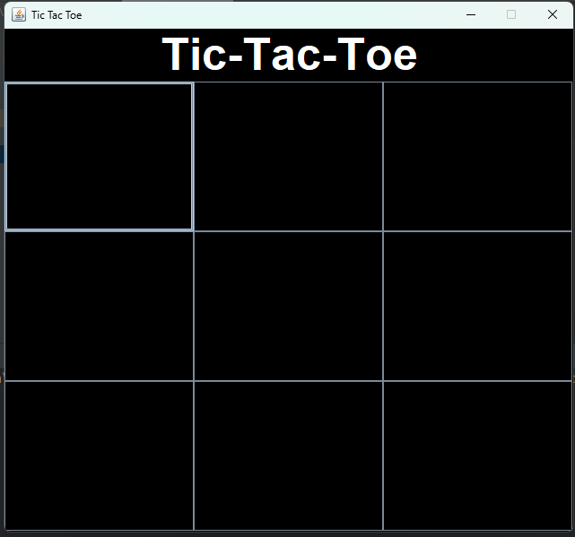
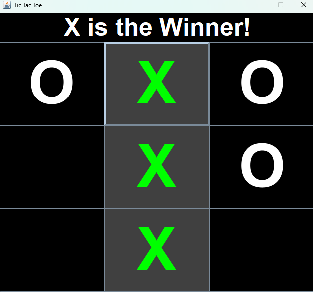
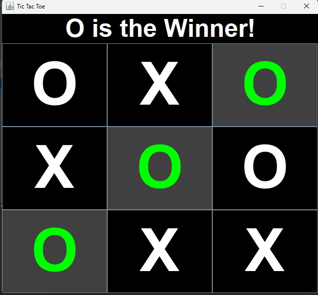
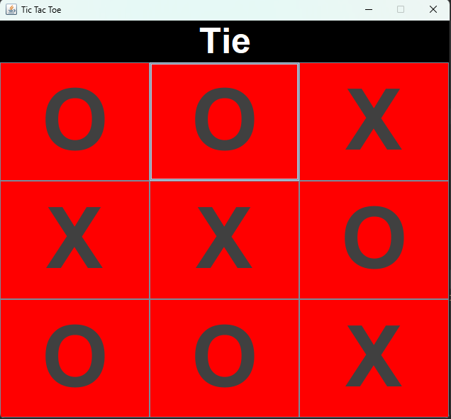

# Tic Tac Toe Game

This project is a simple implementation of the classic Tic Tac Toe game using Java Swing for the graphical user interface. It allows two players to play the game by taking turns and provides visual feedback for wins and ties.

## Table of Contents

- [Features](#features)
- [Prerequisites](#prerequisites)
- [Installation](#installation)
- [Usage](#usage)
- [Code Overview](#code-overview)
    - [TicTacToe Class](#tictactoe-class)
    - [AppMain Class](#appmain-class)
- [Contributing](#contributing)
- [License](#license)
- [Screenshots](#screenshots)

## Features

- Graphical user interface using Java Swing
- 3x3 grid for the game board
- Visual indication of the current player's turn
- Detection of win conditions (horizontal, vertical, and diagonal)
- Indication of a tie if the board is filled without a winner
- Highlighting the winning combination

## Prerequisites

- Java Development Kit (JDK) 8 or later
- An IDE or text editor for Java development (e.g., IntelliJ IDEA, Eclipse, or VS Code)

## Installation

1. Clone the repository:
   ```sh
   git clone https://github.com/yourusername/tic-tac-toe.git
   ```

2. Navigate to the project directory:
   ```sh
   cd tic-tac-toe
   ```

3. Compile the Java files:
   ```sh
   javac TicTacToe.java AppMain.java
   ```

## Usage

Run the compiled `AppMain` class to start the game:
```sh
java AppMain
```

A window will appear with a 3x3 grid and the game title "Tic Tac Toe". Players take turns clicking on the grid to place their marker (X or O). The game will automatically detect and highlight a winning combination or declare a tie if the board is full.

## Code Overview

### TicTacToe Class

The `TicTacToe` class sets up the game board, handles user interactions, and determines the game outcome. Key components include:

- **Instance Variables**:
    - `JFrame frame`: The main window for the game.
    - `JLabel textlabel`: Displays the game status (e.g., current player's turn, winner, or tie).
    - `JPanel textpanel` and `boardpanel`: Panels for the status label and the game board, respectively.
    - `JButton[][] board`: A 3x3 array of buttons representing the game board.
    - `String playerX` and `playerO`: Symbols for the two players.
    - `String currentPlayer`: Tracks whose turn it is.
    - `boolean gameOver`: Indicates if the game has ended.
    - `int turns`: Counts the number of turns taken.

- **Constructor**:
  Initializes the game window, sets up the board, and adds action listeners to handle player moves.

- **checkWinner()**:
  Checks for win conditions (horizontal, vertical, diagonal) and a tie, updating the game status accordingly.

- **setWinner(JButton tile)**:
  Highlights the winning tiles and updates the status label.

- **setTie(JButton tile)**:
  Changes the tile color to indicate a tie and updates the status label.

### AppMain Class

The `AppMain` class contains the `main` method, which serves as the entry point for the application. It creates an instance of the `TicTacToe` class to start the game.

## Contributing

Contributions are welcome! If you have any ideas for improvements or find any bugs, please open an issue or submit a pull request.

1. Fork the repository
2. Create your feature branch (`git checkout -b feature/YourFeature`)
3. Commit your changes (`git commit -m 'Add some feature'`)
4. Push to the branch (`git push origin feature/YourFeature`)
5. Open a pull request

## Screenshots

Here are some screenshots of the game in action:

### Initial Game Screen


### Player X's Turn


### Player O Wins


### Game Tie


